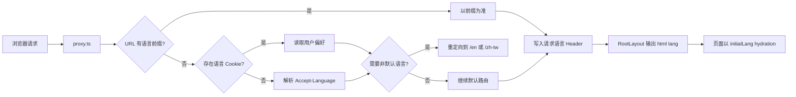

# PetHealthAI 官网技术架构与改造说明

## 1. 改造目标

本轮改造同时解决四类问题：

1. 将单文件首页重构为清晰、可继续演进的业务模块；
2. 把国际化从客户端状态切换升级为服务端可识别、可分享、可索引的语言路由；
3. 修复导航、弹窗、表单和媒体中的实际功能与可访问性问题；
4. 用 Oxlint、Oxfmt 和明确的 TypeScript 检查取代原有 ESLint 单工具链。

设计目标不是建立一个抽象层数量很多的框架，而是让路由、内容、交互和基础组件各自拥有单一职责。

## 2. 当前目录结构

```text
src/
├── app/
│   ├── [locale]/
│   │   ├── page.tsx                 # 英文/繁体首页入口
│   │   └── team/page.tsx            # 英文/繁体团队页入口
│   ├── api/beta-applications/
│   │   └── route.ts                 # 内测申请接收与 Webhook 转发
│   ├── team/page.tsx                # 简体团队页入口
│   ├── layout.tsx                   # 服务端 html lang、字体与全局 metadata
│   ├── page.tsx                     # 简体首页入口
│   └── globals.css
├── components/
│   ├── brand/BrandMark.tsx
│   ├── i18n/LanguageSwitcher.tsx
│   ├── ui/Eyebrow.tsx
│   ├── ui/Modal.tsx
│   └── ScrollProgress.tsx
├── features/
│   ├── home/
│   │   ├── HomePage.tsx             # 首页组合根
│   │   ├── HomeHeader.tsx
│   │   ├── HeroSections.tsx
│   │   ├── TechnologySections.tsx
│   │   ├── CompanySections.tsx
│   │   ├── ConversionSections.tsx
│   │   └── HomeFooter.tsx
│   └── team/TeamPage.tsx
├── hooks/useBodyScrollLock.ts
├── i18n/
│   ├── config.ts                    # 语言、路径与检测纯函数
│   ├── LanguageProvider.tsx         # 客户端语言上下文与路由切换
│   ├── metadata.ts                  # 分语言 SEO metadata
│   ├── translations.ts              # 三语言内容字典
│   └── useLanguagePreference.ts     # Cookie/localStorage 同步
├── lib/name.ts
└── proxy.ts                         # 请求语言识别与首访重定向
```

### 边界原则

- `app` 只负责路由、服务端请求信息和 metadata，不承载大型页面实现。
- `features` 负责具体页面业务区块，不向路由实现反向耦合。
- `components` 只放跨页面复用的品牌或交互原语。
- `i18n` 集中管理语言类型、URL 规则、偏好持久化与翻译内容。
- `lib` 和 `hooks` 保持小而纯，不建立无业务价值的通用工具集合。

## 3. 国际化架构

### 3.1 URL 约定

简体中文为默认语言，不增加前缀；英文和繁体中文使用稳定前缀：

```text
zh     /                 /team
zh-TW  /zh-tw            /zh-tw/team
en     /en               /en/team
```

这种设计带来以下结果：

- 每个语言页面都有稳定、可复制的 URL；
- 浏览器前进/后退与服务端渲染保持一致；
- 搜索引擎可以读取 canonical 和 hreflang；
- 不再依赖 hydration 后修改整页文本来决定页面语言。

### 3.2 请求处理链路



URL 是当前页面语言的唯一事实来源。Cookie 与 `localStorage` 只用于记忆用户下一次访问的偏好，不能覆盖一个明确的语言 URL。

### 3.3 语言切换行为

`LanguageProvider` 在切换时完成三件事：

1. 同步 React 状态、`document.lang`、Cookie 与 `localStorage`；
2. 根据当前 pathname 计算目标语言路径；
3. 保留现有 query string 与 hash，并使用 `router.replace` 避免制造无意义历史记录。

Logo、团队页入口、返回首页和页脚链接均使用 `getLocalizedPath`，不会在页面跳转时掉回简体中文。

### 3.4 语言选择器

选择器保留原生 `<select>` 作为交互层，因此键盘、屏幕阅读器和系统语言菜单无需重新实现；视觉层使用统一的品牌胶囊覆盖原生外观。桌面显示短标签，移动导航显示完整语言名称。

### 3.5 SEO

`i18n/metadata.ts` 为首页和团队页分别生成：

- 分语言 title、description 和 keywords；
- canonical URL；
- `zh-CN`、`zh-TW`、`en` 与 `x-default` hreflang；
- Open Graph locale 与 alternate locale；
- Twitter summary metadata。

生产环境必须配置 `NEXT_PUBLIC_SITE_URL`，使相对 metadata URL 能解析为正式域名。

## 4. 页面组件设计

### 4.1 首页组合

`HomePage` 是唯一的首页组合根，只决定区块顺序和全局 Provider。各区块按内容语义拆分，而不是把每个小卡片都抽成独立文件：

- `HeroSections`：首屏产品舞台与产品系统；
- `TechnologySections`：痛点、硬件、PetMind 与日常连续健康场景；
- `CompanySections`：社群、公司研发体系与团队预览；
- `ConversionSections`：对比、FAQ 与内测转化；
- `HomeHeader` / `HomeFooter`：全站导航边界。

这种粒度让单个文件维持可读性，同时避免大量只被调用一次的薄组件。

### 4.2 共享原语

- `BrandMark`：统一 Logo、字标、明暗样式和多语言首页链接；
- `Eyebrow`：统一区块标签视觉；
- `Modal`：统一焦点圈定、焦点恢复、Escape、背景点击和滚动锁；
- `LanguageSwitcher`：统一语言 UI 与可访问名称；
- `ScrollProgress`：统一页面阅读进度反馈。

### 4.3 状态范围

状态保持在最小可用范围：

- 页面语言在 `LanguageProvider`；
- 移动导航状态在 `HomeHeader`；
- FAQ 展开项在 `FAQSection`；
- 内测选择、表单和提交状态在 `useBetaApplication`；
- 弹窗焦点与滚动行为封装在共享原语。

项目当前没有引入全局状态库，因为没有跨路由、跨领域的复杂客户端状态。新增状态库只会增加 hydration 与维护成本。

## 5. 导航与可访问性

### 导航

- 使用 `IntersectionObserver` 计算当前首页区块；
- 使用 `aria-current="location"` 暴露当前位置；
- 移动导航支持 Escape 关闭，并在进入桌面断点时自动收起；
- 打开移动导航或弹窗时统一锁定 body 滚动；
- 锚点区块使用 `scroll-mt-[76px]` 避免被固定导航遮挡。

### FAQ

- 问题是语义化 heading + button；
- `aria-expanded`、`aria-controls`、`aria-labelledby` 建立问答关系；
- 答案区域使用 `role="region"`。

### Modal

- `role="dialog"` 与 `aria-modal`；
- 初始焦点进入第一个可交互元素；
- Tab / Shift+Tab 保持在弹窗内；
- 关闭后恢复之前焦点；
- Escape 和背景点击均可关闭。

### 动效

- 首页和团队页由 `MotionConfig reducedMotion="user"` 统一尊重系统偏好；
- CSS 在 `prefers-reduced-motion` 下关闭非必要动画和滚动行为；
- 视频在减少动态效果时不加载源文件。

## 6. 媒体与性能

- 所有内容图使用 `next/image`，明确响应式 `sizes`；
- 仅首屏核心产品图和品牌标识使用 priority；
- 下方区块保持默认懒加载；
- 首屏视频先显示静态 poster，允许动态效果后才挂载 MP4 source；
- 视频离开视口后暂停，减少移动设备解码、电量和温度开销；
- Next Image 输出 AVIF/WebP；
- 删除原先未使用的动画、倾斜卡片和背景组件，减少维护面与潜在客户端包体。

## 7. 内测申请功能

### 7.1 前端状态机

```text
idle → submitting → success
                  ↘ error → idle / submitting
```

提交按钮在请求期间禁用，表单通过 `aria-busy` 暴露状态。只有服务端返回成功时才展示成功反馈；输入内容变化会清除旧错误。

### 7.2 API

入口：`POST /api/beta-applications`

请求体：

```json
{
  "name": "string",
  "wechat": "string",
  "email": "string | empty",
  "website": "honeypot",
  "lang": "zh | zh-TW | en",
  "color": "string",
  "plan": "string"
}
```

服务端行为：

- 拒绝超过 16 KiB 的请求；
- 对字符串做 trim 与最大长度截断；
- 校验必填字段、语言和可选 Email；
- 使用隐藏 honeypot 降低基础机器人提交；
- 以 8 秒超时向 `BETA_APPLICATION_WEBHOOK_URL` 转发；
- 可通过 `BETA_APPLICATION_WEBHOOK_TOKEN` 添加 Bearer Token；
- 不把服务端内部错误暴露给浏览器。

Webhook 收到的事件：

```json
{
  "type": "pethealthai.beta-application",
  "submittedAt": "ISO-8601",
  "application": {
    "name": "...",
    "wechat": "...",
    "email": null,
    "language": "zh",
    "color": "...",
    "plan": "..."
  }
}
```

上线前应在接收端补充持久化、通知、重复申请检测和业务侧频率限制。当前应用内不使用进程内 Map 做限流，因为 Serverless 多实例环境下它不能提供一致保证。

## 8. 安全基线

`next.config.ts` 当前设置：

- 移除 `X-Powered-By`；
- `X-Content-Type-Options: nosniff`；
- `Referrer-Policy: strict-origin-when-cross-origin`；
- 禁止 camera、microphone 和 geolocation 权限；
- 启用 same-origin opener 隔离；
- 移除未使用的外部图片域名白名单。

未直接加入 CSP，因为 Next.js 内联运行时代码、字体和未来分析脚本需要结合部署域名与 nonce 策略设计。没有部署上下文时加入宽松 CSP 没有意义，加入过严 CSP 则可能直接破坏页面。

## 9. Oxc 开发工具链

### 9.1 选择

| 职责 | 工具 | 配置 |
| --- | --- | --- |
| JS/TS/React/Next 静态规则 | Oxlint | `.oxlintrc.json` |
| 代码、导入与 Tailwind 类名格式 | Oxfmt | `.oxfmtrc.json` |
| TypeScript 类型系统 | `tsc --noEmit` | `tsconfig.json` |
| 编辑器体验 | 官方 Oxc VS Code 扩展 | `.vscode/*` |

已移除 ESLint 与 `eslint-config-next` 依赖和配置。Oxlint 启用了原生的 TypeScript、React、Import、jsx-a11y 与 Next.js 插件，并将 warning 上限设为 0。

### 9.2 为什么暂不启用 type-aware Oxlint

Oxlint 的 type-aware 模式当前依赖 `oxlint-tsgolint` 与 TypeScript 7 语义。项目依赖仍在 TypeScript 5.9 稳定线，因此本次明确设置 `typeAware: false`，继续使用 `tsc --noEmit` 做完整类型检查。

未来升级 TypeScript 7 时，可以评估：

1. 安装与 Oxlint 同版本兼容的 `oxlint-tsgolint`；
2. 设置 `options.typeAware: true`；
3. 评估 `options.typeCheck: true` 是否能替代独立 `tsc`；
4. 对比 Next 类型生成、路径别名和增量检查结果后再移除 `typecheck` 脚本。

### 9.3 Oxfmt 策略

- 120 列宽、2 空格、双引号、分号与 trailing commas；
- 自动排序 imports；
- 自动排序 package.json 与 scripts；
- 根据 `src/app/globals.css` 排序 Tailwind CSS 4 类名；
- 忽略构建产物、依赖目录、二进制资源、锁文件和原官网内容归档。

## 10. 环境与部署

### 必需配置

```dotenv
NEXT_PUBLIC_SITE_URL=https://正式域名
BETA_APPLICATION_WEBHOOK_URL=https://接收端
BETA_APPLICATION_WEBHOOK_TOKEN=可选密钥
```

### 建议部署前流程

```bash
pnpm install
pnpm check
pnpm build
```

### 本轮未执行的动作

根据任务约束，本轮没有执行安装、格式化、Lint、TypeScript 检查、构建或浏览器验证。`package.json` 已切换到 Oxlint/Oxfmt，但 `pnpm-lock.yaml` 仍需在最终收敛时通过 `pnpm install` 正常重算，不能手工伪造。

## 11. 最终收敛清单

- [ ] 运行 `pnpm install` 更新锁文件和本地依赖；
- [ ] 运行 `pnpm format` 接受一次 Oxfmt 的全量格式化；
- [ ] 运行 `pnpm check`，处理首次 Oxlint/Oxfmt 迁移产生的规则差异；
- [ ] 运行 `pnpm build`，检查 Next 16 的路由与 metadata 产物；
- [ ] 手动检查 `/`、`/zh-tw`、`/en` 及三个团队页；
- [ ] 检查语言切换是否保留 query/hash；
- [ ] 配置正式域名与 Webhook，并完成一次真实内测提交；
- [ ] 用键盘检查移动导航、FAQ 和内测弹窗焦点顺序；
- [ ] 在减少动态效果模式下检查视频与无限动画；
- [ ] 在真实移动设备上检查首屏视频、图片解码和滚动性能。
